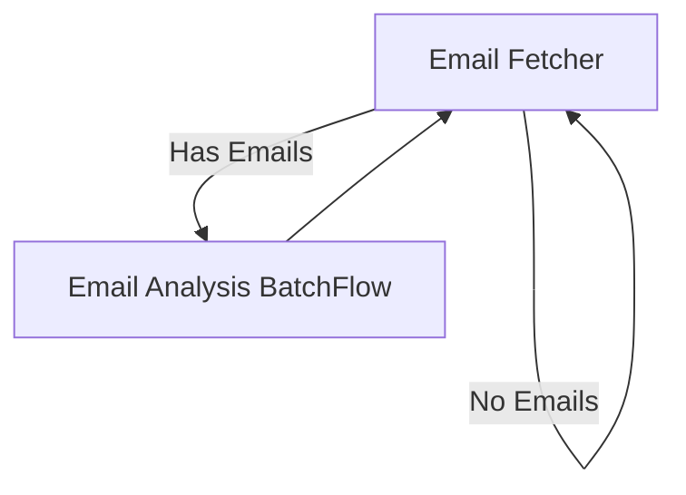
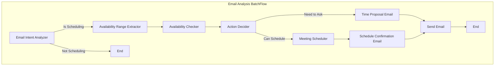

# AI Meeting Scheduler

This project is a simple AI-powered meeting scheduler that uses a LLM to process email requests and schedule meetings on the user's Google Calendar.

## Project Requirements

### Core Entities
1. User: The user who sends email requests to AI Meeting Scheduler to schedule meetings
2. Guests: The people invited to the meeting
3. Google Calendar Meetings: The meetings on the user's Google Calendar


### Functional Requirements
The AI Meeting Scheduler must:
1. Monitor incoming emails (must from the user's email address) to detect scheduling requests
2. Extract meeting details (guests, duration, timeframe) from emails
3. Check user's calendar availability
4. Propose available time slots to guests
5. Process guest responses
6. Double-check final time slot availability
7. Send calendar invites to all participants

## Utility Functions

### `utils/call_llm.py`
- `call_llm(prompt: str) -> str`: Call the LLM to get the response
  - Parameters:
    - prompt: The text prompt to send to the LLM
  - Returns:
    - The LLM's response as a string

### `utils/check_unread_emails.py`
- `check_unread_emails()`: Connect to Gmail via IMAP to fetch unread emails from the user's inbox
  - Uses IMAP protocol with SSL encryption
  - Automatically marks fetched emails as read
  - Returns a list of email dicts containing:
    - sender: Email address and name of sender (in "Name <email@example.com>" format)
    - to: List of primary recipient email addresses (parsed from "Name <email@example.com>" format)
    - cc: List of CC recipient email addresses (parsed from "Name <email@example.com>" format)
    - bcc: List of BCC recipient email addresses (parsed from "Name <email@example.com>" format)
    - subject: Email subject (decoded with proper character encoding)
    - body: Email body text (supports both plain text and HTML)
    - timestamp: When email was received (as datetime object)
    - message_id: Unique identifier of the email
    - in_reply_to: Message ID of the email this one is replying to (if any)
    - references: Thread reference IDs for email chain
    - reply_to: Email address for replies if provided

### `utils/check_availability.py`
- `check_availability(start_time, end_time)`: Check Google Calendar for free/busy slots
  - Parameters:
    - start_time: datetime object for start of time range
    - end_time: datetime object for end of time range
  - Returns:
    - List of available time slots as (start, end) datetime tuples
    - Each slot is minimum meeting duration (e.g. 30 min)
    - Respects working hours (e.g. 9am-5pm)
    - Excludes existing meetings and blocked time

### `utils/schedule_meeting.py`
- `schedule_meeting(meeting_details)`: Create and send Google Calendar meeting invite
  - Parameters:
    - meeting_details: dict containing:
      - title: Meeting title/subject
      - start_time: Meeting start datetime
      - end_time: Meeting end datetime
      - description: Meeting description/agenda
      - attendees: List of guest email addresses
      - location: Meeting location/conference link (optional)

### `utils/send_email.py`
- `send_email()`: Send emails via Gmail SMTP with threading support
  - Parameters:
    - subject: Email subject (auto-prepends "Re:" for replies)
    - body: Plain text email body
    - to_emails: Single email address or list of addresses
    - from_email: Sender's Gmail address
    - app_password: Gmail app-specific password
    - from_name: Display name for sender (defaults to "AI Meeting Scheduler")
    - in_reply_to: Optional Message-ID being replied to
    - references: Optional thread reference IDs
  - Features:
    - SSL encryption for secure email transmission
    - Proper email threading via In-Reply-To and References headers
    - Support for multiple recipients
    - Automatic "Re:" subject prefixing for replies

## Flow Design

The meeting scheduler uses a batch approach to process multiple emails efficiently:

1. **Email Fetcher Node**
   - `prep`: Get email configuration from shared state
   - `exec`: 
     - Call `check_unread_emails()` to fetch new emails
     - Parse authorized sender email (handles "Name <email@example.com>" format)
     - Filter for authorized sender in From, CC, or BCC fields
     - Properly handles multiple CC/BCC recipients
   - `post`: 
     - If no emails, wait 30 seconds and return "monitor"
     - Otherwise, store emails in shared["pending_emails"]
     - Return "analyze_batch"

2. **Email Analysis Batch Flow**
   - Takes email_id as parameter
   - For each email in shared["pending_emails"], runs:

   a. **Email Intent Analyzer Node**
      - `prep`: Get email content from shared["pending_emails"][email_id]
      - `exec`:
        - Call `call_llm()` to determine if email is for scheduling
        - Returns simple yes/no classification
      - `post`:
        - If yes: Return "extract_availability_range"
        - If no: Return "end"

   b. **Availability Range Extractor Node**
      - `prep`: Get email content from shared["pending_emails"][email_id]
      - `exec`:
        - Call `call_llm()` to extract time range to check:
          - If list of specific times/ranges provided (e.g., "Tuesday 2-3pm, Wednesday 1-4pm, Friday 9-11am"):
            - Take minimum datetime as range start (e.g., Tuesday 2pm)
            - Take maximum datetime as range end (e.g., Friday 11am)
          - If general timeframe mentioned (e.g., "this week"):
            - Use today to end of week
          - If no timeframe mentioned:
            - Use next week (Monday to Friday)
          - Also extracts:
            - Meeting duration
            - Attendees
            - Meeting purpose/title
      - `post`:
        - Store extracted range and meeting details in shared["requests"][request_id]
        - Return "check_availability"

   c. **Availability Checker Node**
      - `prep`: Get timeframe and duration from shared["requests"][request_id]
      - `exec`:
        - Call `check_availability()` to get all available slots in the range
      - `post`:
        - Store available slots in request
        - Return "decide_next_action"

   d. **Action Decider Node**
      - `prep`: Get email content, available slots, and all previous guest responses from request
      - `exec`:
        - Call `call_llm()` to analyze:
          - If we have guest availability (from current email or previous responses) that overlaps with user's available slots:
            - Choose the best time that works for everyone
            - Consider factors like earliest available time or most people's preferences
          - If we don't have guest availability or no times work for everyone:
            - Need to propose available times to guests
      - `post`:
        - If found working time: Return "schedule"
        - If need to propose: Return "ask_time"

   e. **Meeting Scheduler Node**
      - `prep`: Get chosen time and meeting details from request
      - `exec`:
        - Call `schedule_meeting()` to create calendar event
      - `post`:
        - Update request status
        - Return "send_scheduled_email"

   f. **Schedule Confirmation Email Node**
      - `prep`: Get meeting details and email threading info
      - `exec`:
        - Call `call_llm()` to draft confirmation email
      - `post`:
        - Store drafted email in request
        - Return "send_email"

   g. **Time Proposal Email Node**
      - `prep`: Get available slots and email threading info
      - `exec`:
        - Call `call_llm()` to draft email with available times
      - `post`:
        - Store drafted email in request
        - Return "send_email"

   h. **Send Email Node**
      - `prep`: Get drafted email content and threading info from request
      - `exec`:
        - Call `send_email()` to send the email with proper threading
      - `post`:
        - Update request status
        - Return "monitor"





## Data Structure

The scheduler uses a shared state dictionary to maintain state and configuration across all nodes:

```python
shared = {
    "pending_emails": {  # Unprocessed emails
        "message_id": {
            "sender": str,  # "Name <email@example.com>" format
            "to": List[str],  # List of primary recipient email addresses
            "cc": List[str],  # List of CC email addresses
            "bcc": List[str],  # List of BCC email addresses
            "subject": str,
            "body": str,
            "timestamp": datetime,
            "message_id": str,
            "in_reply_to": str,
            "references": List[str],
            "reply_to": str,
            "request": {  # Meeting request data stored directly with email
                "status": str,  # "pending", "scheduled", "cancelled"
                "meeting": {
                    "duration": int,  # Duration in minutes
                    "timeframe": {
                        "start": datetime,
                        "end": datetime
                    },
                    "attendees": List[str],
                    "location": Optional[str],
                    "description": str
                },
                "available_slots": List[Tuple[datetime, datetime]],  # List of available time slots
                "chosen_slot": Optional[Tuple[datetime, datetime]],  # Final chosen time slot
                "responses": {  # Track responses from attendees
                    "email@example.com": {
                        "status": str,  # "accepted", "declined", "tentative"
                        "timestamp": datetime,
                        "message_id": str  # ID of response email
                    }
                }
            }
        }
    },
    "config": {  # Configuration settings
        "email": {
            "username": str,
            "password": str
        },
        "authorized_user": str,  # Email of authorized user
        "working_hours": {
            "start": int,  # Hour of day (0-23)
            "end": int
        },
        "min_meeting_duration": int  # Minutes
    }
}
```